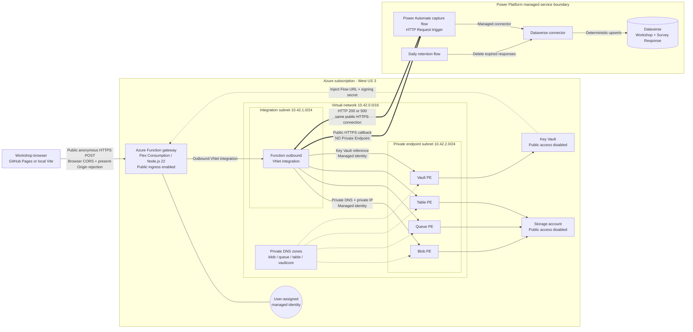

# Survey Collection Network and Data Flow

This document separates the network paths that are private from the callback URL that is merely secret.

## Network topology



## Runtime sequence

```mermaid
sequenceDiagram
  autonumber
  participant B as Workshop browser
  participant F as Azure Function
  participant T as Azure Table via private endpoint
  participant P as Power Automate HTTP trigger
  participant C as Dataverse connector
  participant D as Dataverse

  Note over F,T: Function uses VNet integration, private DNS, private IP, and managed identity
  Note over F,P: Flex routes outbound through VNet integration, then reaches the Flow public HTTPS endpoint; no Private Endpoint is configured

  B->>F: POST /api/feedback (public HTTPS)
  F->>F: Origin, HMAC, schema, consent, and progress validation
  F->>T: Consume durable rate-limit entry (private path)
  T-->>F: Allowed or limited
  F->>P: Normalized JSON + X-Correlation-ID
  P->>C: Upsert Workshop using workshopId
  C->>D: UpdateRecord mjsrc_workshops
  D-->>C: Success
  P->>C: Upsert Survey Response using submissionId
  C->>D: UpdateRecord mjsrc_surveyresponses + Workshop lookup
  D-->>C: Success
  P-->>F: HTTP 200 + matching submissionId
  F-->>B: HTTP 200 + matching submissionId
```

## What is private and what is not

| Path | Network treatment | Authentication or protection |
| --- | --- | --- |
| Browser to Azure Function | Public anonymous HTTPS | Browser CORS plus rejection of a present, non-allowlisted Origin; signed workshop claim, schema validation, and rate limiting. Origin-less non-browser callers are not authenticated by CORS. |
| Function to Storage | VNet integration to private endpoints | User-assigned managed identity and Storage data-plane RBAC |
| Function to Key Vault | VNet integration to the Vault private endpoint | User-assigned managed identity and Key Vault RBAC |
| Function to Power Automate | Flex Consumption routes outbound through VNet integration, then to the signed Request-trigger's public HTTPS endpoint | Callback URL is stored as a Key Vault secret; no Private Endpoint or private Power Platform route is configured |
| Power Automate to Dataverse | Power Platform managed connector path | Solution connection reference and connector identity; not routed through the Azure VNet |

## Identity and authorization relationships

| Principal or connection | Target | Deployed role or mechanism |
| --- | --- | --- |
| Function user-assigned managed identity | Storage account | Storage Blob Data Owner, Storage Blob Data Contributor, Storage Queue Data Contributor, and Storage Table Data Contributor |
| Function user-assigned managed identity | Key Vault | Key Vault Secrets Officer; `keyVaultReferenceIdentity` selects this identity for app-setting references |
| Function user-assigned managed identity | Application Insights | Monitoring Metrics Publisher and Entra-authenticated telemetry configuration |
| Power Automate capture Flow | Dataverse | `shared_commondataserviceforapps` solution connection reference; this connector identity is separate from the Function managed identity |
| Deployment user | Key Vault | Key Vault Secrets Officer for deployment-time secret initialization |

The deployed Key Vault role is operationally broad (`Key Vault Secrets Officer`), so the diagram describes a managed-identity boundary rather than claiming strict least privilege.

## Network controls not present in this deployment

- No Private Endpoint or Private Link from Azure Function to Power Automate.
- No Power Platform VNet peering or delegated Power Platform subnet.
- No API Management gateway or self-hosted gateway in the Function-to-Flow path.
- No NAT Gateway, Azure Firewall, route table, or network security group declared by this Bicep deployment.
- No Azure Monitor Private Link Scope (AMPLS); Application Insights ingestion uses its public Azure Monitor endpoint through Flex VNet-integrated egress.
- Function ingress remains public. Storage and Key Vault public network access are disabled.

## Important clarification

`SURVEY_FLOW_URL` is a **private secret**, not a **private network endpoint**. The current solution does not define a Power Automate Private Endpoint, API Management private gateway, self-hosted gateway, or private route to Power Platform. Flex Consumption routes all Function outbound traffic through the VNet integration subnet; the Flow call then leaves that egress path for the Power Automate Request trigger's signed public HTTPS URL. Private Link in this deployment protects Storage and Key Vault.
